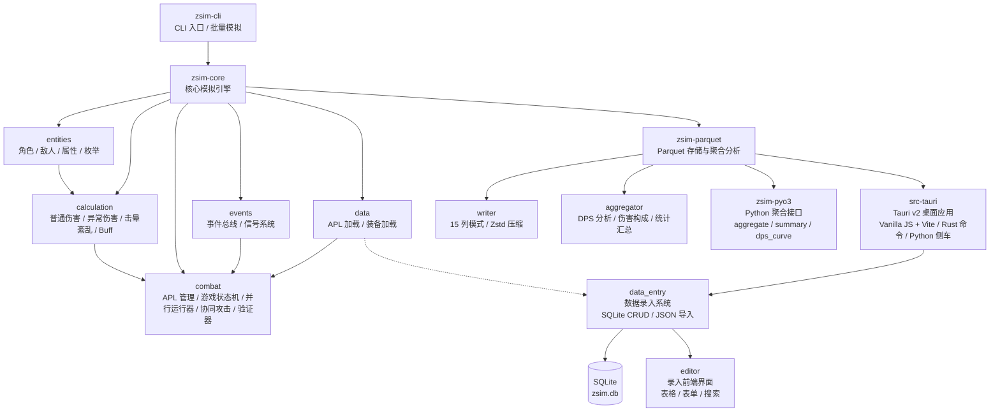
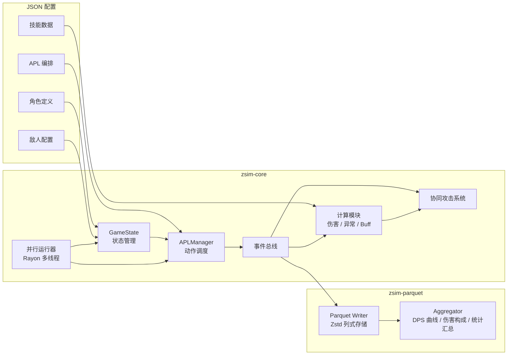

# ZSim Analyzer — 绝区零 DPS 模拟器

ZSim 是一个面向 **《绝区零 (Zenless Zone Zero)》** 的 combat DPS 模拟引擎，支持动作序列编排、伤害计算、并行模拟与数据可视化分析。最初由 Python 原型实现，目前正在向 Rust 高性能引擎迁移。

## 功能

- **Tick 驱动引擎** — 以 1/60 秒为步长的精确战斗模拟
- **技能系统** — 支持普攻、特殊技、终结技、连携技、闪避、协同攻击等多种技能类型
- **APL 动作编排** — 通过 JSON 配置文件编排角色动作序列（Action Priority List），支持多轨道并行执行
- **完整伤害公式** — 覆盖常规伤害、异常伤害、紊乱/极性紊乱、击晕值计算，包括暴击、防御、穿透、抗性、减伤
- **敌人系统** — 支持多种敌人类型（普通/精英/Boss），含属性抗性、异常积蓄、失衡值
- **Buff/Debuff 管理** — 基于 tick 的 buff 过期与状态维护
- **异常系统** — 异常积累、触发、紊乱与极性紊乱机制
- **协同攻击** — 支持角色协同动作的响应式触发系统
- **并行模拟** — 基于 Rayon 的多线程并行批量模拟
- **数据存储** — 模拟结果以 Apache Parquet 列式格式存储，支持 Zstd 压缩，含 15 字段的规范化事件模式
- **数据分析** — 支持总伤害、DPS 曲线、伤害构成、异常统计、暴击率统计等聚合查询
- **桌面 GUI** — Tauri v2 桌面应用，提供可视化操作界面
- **数据录入系统** — 独立的 Tauri 桌面数据录入界面，支持角色/技能/装备/敌人的可视化 CRUD 管理
- **SQLite 持久化** — 录入数据通过 SQLite 本地存储，与模拟引擎解耦但数据结构兼容
- **JSON 导入** — 支持从 JSON 文件批量导入游戏数据（角色/技能/装备/敌人/APL）
- **数据总览与搜索** — 仪表盘展示数据统计，支持跨表快速搜索
- **多语言** — 中/英/日三语界面 (i18n)
- **数据导出** — 支持 HTML 报告和 CSV 导出

## 项目架构

该项目采用 **Rust workspace** 多包架构，辅以 Python 侧车进程：

```
zsim-rework/
├── zsim-core/          # 核心模拟引擎（Rust）
│   ├── calculation/    # 伤害/异常/击晕/紊乱计算模块
│   ├── combat/         # 战斗系统（APL 管理器、游戏状态机、并行运行器、协同系统）
│   ├── data/           # 数据加载（APL 定义、装备、技能数据）
│   ├── entities/       # 实体模型（角色、敌人、属性、枚举）
│   └── events/         # 事件总线与信号系统
├── zsim-cli/           # 命令行界面（Rust）
├── zsim-parquet/       # Parquet 列式存储与聚合查询（Rust）
├── zsim-pyo3/          # Python 扩展模块，暴露 Rust 聚合接口（Rust → Python）
├── src-tauri/          # Tauri v2 桌面应用壳（Rust + Vanilla JS + Vite）
│   ├── src/
│   │   └── data_entry/ # 数据录入后端（Rust CRUD + SQLite + JSON 导入导出）
│   │       ├── db.rs           # SQLite Schema 初始化（8 张业务表）
│   │       ├── characters.rs   # 角色 CRUD 命令
│   │       ├── skills.rs       # 技能 CRUD 命令（含倍率段管理）
│   │       ├── equipment.rs    # 装备 CRUD 命令（音擎/驱动盘/套装）
│   │       ├── enemies.rs      # 敌人 CRUD 命令
│   │       ├── queries.rs      # 数据概览与跨表搜索
│   │       ├── import.rs       # JSON 文件批量导入
│   │       └── export.rs       # 数据导出（HTML/CSV）
│   └── ...
├── src/                # 前端源码（Vanilla JS + Vite）
│   ├── editor/         # 数据录入前端界面
│   │   ├── app.js      # 入口文件（hash 路由 + 懒加载页面）
│   │   ├── pages/      # 页面组件（dashboard/characters/skills/equipment/enemies/import）
│   │   ├── components/ # 通用组件（sidebar/datatable/form/modal/confirm）
│   │   └── utils/      # 工具函数（api/validation/format）
│   ├── i18n.js         # 国际化支持（zh-CN/en-US/ja-JP）
│   └── ...
├── scripts/            # 构建与部署脚本
├── data/               # 游戏数据文件（角色、技能、APL 定义）
└── Docs/               # 项目文档
```

### 知识图谱



### 模拟引擎数据流



## 使用方式

### CLI 命令行

```bash
# 运行模拟（当前为占位，完整功能开发中）
cargo run -p zsim-cli -- run

# 查看 Parquet 结果统计
cargo run -p zsim-cli -- stats
```

### 以库的形式使用

```rust
use std::collections::HashMap;
use zsim_core::combat::runner::{SimConfig, SimulationRunner};
use zsim_core::entities::character::Character;
use zsim_core::entities::enums::*;

// 创建角色、敌人、技能和 APL 配置
let config = SimConfig {
    max_tick: 3600,  // 60 秒
    seed: 42,
    // ... 配置队伍、敌人、技能、APL
};

// 运行单次模拟
let result = SimulationRunner::run(config);
println!("模拟运行了 {} ticks", result.total_ticks);
println!("终止原因: {:?}", result.termination_reason);
```

### 并行批量模拟

```rust
use std::sync::Arc;
use zsim_core::combat::parallel::{ParallelConfig, ParallelRunner};

let config = ParallelConfig {
    sim_count: 1000,       // 运行 1000 次模拟
    base_seed: 42,
    max_tick: 18000,
    // ... 使用 Arc 共享配置数据
};

let (results, progress_rx) = ParallelRunner::run(config);
for update in progress_rx {
    match update {
        ProgressUpdate::Percentage(pct) => println!("{:.0}%", pct),
        ProgressUpdate::Done => println!("完成!"),
    }
}
```

### 桌面应用 (Tauri)

```bash
# 开发模式
cd src-tauri
npm run tauri dev

# 构建生产版本
npm run tauri build
```

### Python 数据分析

```python
import zsim_rs

# 统计汇总
stats = zsim_rs.summary("results/sim_001.parquet")
print(stats)

# DPS 曲线（窗口 = 60 ticks = 1 秒）
dps = zsim_rs.dps_curve("results/sim_001.parquet", 60)

# 伤害构成
breakdown = zsim_rs.damage_breakdown("results/sim_001.parquet")
```

### 模拟配置格式

APL (Action Priority List) 使用 JSON 格式定义角色动作序列：

```json
{
  "tracks": [
    {
      "track_id": "track_01",
      "char_id": "anby_demara",
      "actions": [
        { "action_id": "Attack_Normal_1", "at": 0 },
        { "action_id": "Attack_Normal_2", "at": 30 },
        { "action_id": "Skill_Ex_1", "at": 60 }
      ]
    }
  ]
}
```

## 开发

### 环境要求

- Rust 1.85+
- Python >= 3.13（用于数据分析侧车进程）
- Node.js 20+（用于 Tauri 前端）
- protoc（编译 Parquet 依赖）

### 构建

```bash
# 构建全部
cargo build

# 运行测试
cargo test

# Python 扩展
cd zsim-pyo3
maturin develop

# 桌面应用
cd src-tauri
npm install
npm run tauri dev
```

### 项目状态

当前为 **initial_build** 阶段，核心引擎正在从 Python 向 Rust 迁移。已完成的模块：
- [x] 基础实体模型（角色、敌人、属性、枚举）
- [x] 完整伤害计算公式（常规/异常/紊乱/击晕）
- [x] 事件总线系统（12 种事件类型的发布-订阅）
- [x] APL 动作调度引擎（多轨道、动画帧、蓄力分支）
- [x] 游戏状态机与终止条件判定
- [x] 资源验证（能量、HP、Decibel、冷却）
- [x] Buff/Debuff 管理
- [x] 异常积累与触发系统
- [x] 并行模拟执行器（Rayon）
- [x] Parquet 列式存储（15 字段模式）
- [x] Parquet 聚合查询（DPS、伤害构成、统计汇总）
- [x] PyO3 Python 绑定
- [x] Tauri v2 桌面 GUI
- [x] i18n 多语言支持
- [x] 数据导出（HTML/CSV）
- [x] SQLite 数据持久化（8 张业务表 + 元数据表）
- [x] JSON 批量导入（角色/技能/装备/敌人/APL）
- [x] 数据录入 CRUD 后端（Rust + Tauri 命令）
- [x] 数据录入前端界面（角色/技能/装备/敌人管理 + 仪表盘 + 搜索）
- [ ] 协同攻击系统（完成基础框架，待丰富触发规则）
- [ ] 邦布独立行动轴与连携判定
- [ ] 装备驱动盘数据加载与计算
- [ ] UI 设置面板

## 许可证

MIT License
